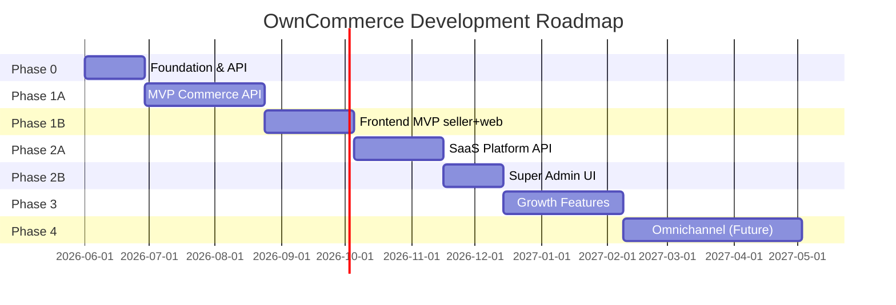

# Rencana Pengembangan OwnCommerce

> Dokumen ini merupakan rencana pengembangan berdasarkan [detail-product.md](./detail-product.md).

---

## Ringkasan Pemahaman

| Aspek | Keputusan |
|---|---|
| **Produk** | SaaS e-commerce untuk merchant punya toko sendiri (bukan marketplace) |
| **Target** | UMKM, brand lokal, seller Shopee/TikTok Shop/Lazada |
| **Arsitektur** | Multi-tenant shared DB + shared schema (`tenant_id` di semua data) |
| **Backend** | Go + Fiber + GORM + PostgreSQL + Redis + Asynq |
| **Frontend** | React + Vite + TypeScript — `web`, `seller`, `superadmin` |
| **UI Library** | Ant Design 5 — tema putih dominan, clean & minimal |
| **File Storage** | Local storage (filesystem server) |
| **Hosting** | VPS sendiri (Docker) |
| **CI/CD** | GitHub Actions → automated deploy ke VPS |
| **Domain** | `owncommerce.id` (akan dibeli) |
| **Payment** | Midtrans (storefront MVP + subscription billing) |
| **Skala target** | 10.000+ tenant aktif |

---

## Prinsip Pengembangan

1. **MVP dulu, omnichannel belakangan** — jangan bangun marketplace sync di fase awal.
2. **Tenant isolation dari hari pertama** — semua query wajib `tenant_id`; ini sulit ditambah belakangan.
3. **Modular monolith** — modul jelas, boundary API internal, siap dipecah nanti.
4. **Ship early, iterate** — merchant bisa jualan online dalam 8–12 minggu (MVP).
5. **Feature flag + subscription** — batasi fitur per paket sejak awal, meski paket awal masih sederhana.
6. **API-first, UI mengikuti** — backend stabil dulu, frontend React + Ant Design menyusul (Phase 1B).

---

## Fase Pengembangan (Roadmap)



---

## Phase 0: Foundation (Minggu 1–4)

**Tujuan:** Infrastruktur, monorepo, dan fondasi multi-tenant siap dipakai tim.

> **Strategi saat ini:** Fokus **local development** dulu. VPS, CI/CD deploy, dan Nginx ditunda sampai MVP backend stabil di mesin lokal.

### 0.1 Monorepo & Tooling

```
owncommerce/
├── apps/
│   ├── web/          → React + Vite (storefront customer)
│   ├── seller/       → React + Vite (merchant dashboard)
│   ├── superadmin/   → React + Vite (internal platform)
│   └── api/          → Go Fiber
├── packages/
│   ├── ui/           → Ant Design theme, layout, shared components
│   ├── types/        → Shared TypeScript types
│   ├── sdk/          → API client untuk frontend
│   └── shared/       → Utils, constants
├── storage/          → Local file storage (product images, assets, invoices)
├── infra/
│   ├── docker/
│   ├── nginx/        → Reverse proxy + SSL
│   ├── scripts/      → Deploy script VPS
│   └── migrations/
└── docs/
```

**Deliverables:**

- [x] Setup monorepo (Turborepo + npm workspaces)
- [x] Docker Compose dev: PostgreSQL, Redis (`infra/docker/docker-compose.dev.yml`)
- [x] Local storage directory (`storage/`)
- [x] Environment management (`.env.example`)
- [x] Go API skeleton (Fiber + GORM)
- [ ] Docker Compose prod (ditunda)
- [ ] CI/CD pipeline: lint, test, build, automated deploy ke VPS (ditunda)
- [ ] VPS provisioning: Docker, Nginx, SSL (ditunda)

### 0.2 Database Schema Foundation

Tabel inti multi-tenant:

| Tabel | Keterangan |
|---|---|
| `tenants` | Data merchant/toko |
| `tenant_domains` | Subdomain + custom domain |
| `users` | Semua user (super admin + merchant + customer) |
| `roles`, `permissions`, `role_permissions` | RBAC dinamis |
| `user_roles` | Assignment role per tenant |
| `audit_logs` | Audit trail |
| `subscriptions`, `plans`, `plan_features` | Subscription |
| `feature_flags` | Feature gating |

**Aturan wajib:** middleware `tenant_id` di setiap query commerce.

### 0.3 Core Platform Modules (Backend)

Prioritas implementasi:

```
1. Auth        → JWT (access + refresh), rotation, revocation
2. Tenant      → CRUD tenant, subdomain provisioning
3. IAM         → RBAC dinamis, permission check middleware
4. Audit       → Event logging middleware
```

**Deliverables:**

- [x] Auth API (register merchant, login, refresh, logout)
- [x] Tenant resolver middleware (Host header + `X-Tenant-Slug` untuk local dev)
- [x] RBAC middleware (`product.view`, dll.)
- [x] Audit log writer
- [x] Health check & API versioning (`/v1/`)
- [x] GORM models + AutoMigrate + seed (roles, permissions, plans)
- [x] Local file storage module

---

## Phase 1A: MVP Core Commerce — API (Minggu 5–12)

**Tujuan:** Backend siap — merchant bisa daftar, tambah produk, customer bisa beli, merchant kelola pesanan via API.

> **Status:** Backend API selesai. Lanjut ke Phase 1B (frontend).

### 1.1 Merchant Onboarding Flow

```
Daftar → Buat Tenant → Pilih Subdomain → Setup Toko Dasar → Dashboard
```

**Fitur:**

- [x] Registrasi merchant owner (Phase 0)
- [x] Auto-provision subdomain (`toko.localhost` di dev)
- [x] Store settings API (nama, deskripsi, kontak, alamat)
- [ ] Onboarding wizard → Phase 1B (`seller`)

### 1.2 Product & Catalog (Merchant Dashboard)

- [x] CRUD produk (nama, deskripsi, harga, gambar, SKU)
- [x] Kategori (hierarki 1 level)
- [x] Upload gambar → local storage
- [x] Status produk (draft, active, archived)
- [x] Inventory dasar (stock quantity, low stock threshold)

### 1.3 Storefront (Customer-facing)

- [x] Homepage API (featured products)
- [x] Product catalog + filter kategori
- [x] Product detail (by slug)
- [x] Search produk (ILIKE)
- [ ] Responsive mobile-first → Phase 1B (`web`)

### 1.4 Cart & Checkout

- [x] Guest cart (`X-Cart-Session`) + logged-in cart
- [x] Checkout: alamat, shipping cost, ringkasan
- [x] Order creation (status: `pending_payment`)
- [x] Integrasi Midtrans Snap API
- [x] Webhook handler Midtrans
- [ ] Halaman payment success / failed → Phase 1B (`web`)
- [x] Order detail API (konfirmasi via API)

### 1.5 Order Management (Merchant)

- [x] Daftar pesanan + filter status
- [x] Detail pesanan
- [x] Update status (processing → shipped → completed)
- [x] Cancel order

### 1.6 Customer Account (Storefront)

- [x] Registrasi & login customer (per tenant)
- [x] Profil customer (`/storefront/me`)
- [x] Alamat pengiriman (create, list)
- [x] Riwayat pesanan
- [x] Tracking status pesanan (via order detail)

**Phase 1A Exit Criteria:**

> [x] Semua flow commerce bisa diuji via API (curl / Postman). Lihat `docs/testing-fase1.md`.

---

## Phase 1B: Frontend MVP — `seller` + `web` (Minggu 13–18)

**Tujuan:** UI end-to-end — merchant kelola toko lewat dashboard, customer belanja lewat storefront.

**Tech:** React 18 + Vite + TypeScript + Ant Design 5 + React Router

### 1B.0 Design System & Shared Packages

Setup fondasi UI di `packages/ui` sebelum halaman aplikasi.

**Prinsip visual** (referensi: clean dashboard, dominan putih):

| Elemen | Spesifikasi |
|---|---|
| Background utama | `#FFFFFF` / `#FAFAFA` |
| Sidebar | Putih, border kanan tipis `#F0F0F0` |
| Card | Putih, border `#F0F0F0`, radius 8–12px, shadow minimal |
| Teks utama | `#1A1A1A` / `#262626` |
| Teks sekunder | `#8C8C8C` |
| Aksen / primary | `#1677FF` (Ant Design default blue) |
| Hero banner | Dark gradient (kontras) — opsional di dashboard |
| Typography | System / Inter — clean sans-serif |
| Spacing | Luas, breathable — padding 24–32px di content area |

**Deliverables:**

- [ ] `packages/ui` — Ant Design `ConfigProvider` + custom theme token
- [ ] `packages/ui` — `AppLayout` (sidebar + header + content) seperti referensi
- [ ] `packages/ui` — shared components: `PageHeader`, `EmptyState`, `Loading`
- [ ] `packages/sdk` — typed API client (auth, merchant, storefront)
- [ ] `packages/types` — shared TypeScript interfaces dari API response

### 1B.1 Merchant Dashboard (`apps/seller`)

Layout: sidebar kiri + content area kanan (mirip referensi Sell Bridge).

| Halaman | Route | Fitur |
|---|---|---|
| Login / Register | `/login`, `/register` | Form Ant Design, JWT storage |
| Dashboard | `/` | Ringkasan: total order, produk aktif, low stock |
| Store Settings | `/settings` | Update profil toko |
| Categories | `/categories` | Table + modal CRUD |
| Products | `/products` | Table + form create/edit + upload gambar |
| Product Detail | `/products/:id` | Edit produk + inventory |
| Orders | `/orders` | Table filter status |
| Order Detail | `/orders/:id` | Detail + update status |

**Deliverables:**

- [ ] Setup Vite + React + TypeScript + Ant Design
- [ ] Auth flow (login, register, token refresh, protected routes)
- [ ] Sidebar navigation + layout responsif (collapse di mobile)
- [ ] CRUD kategori & produk
- [ ] Upload gambar produk
- [ ] Daftar & kelola pesanan
- [ ] Onboarding wizard setelah register

### 1B.2 Storefront (`apps/web`)

Layout: header toko + content — tetap clean putih, fokus produk (bukan sidebar admin).

| Halaman | Route | Fitur |
|---|---|---|
| Home | `/` | Hero toko + featured products |
| Catalog | `/products` | Grid produk + filter kategori + search |
| Product Detail | `/products/:slug` | Gambar, harga, deskripsi, add to cart |
| Cart | `/cart` | List item, update qty |
| Checkout | `/checkout` | Form alamat + ringkasan |
| Payment | `/payment/:orderId` | Midtrans Snap embed |
| Success / Failed | `/payment/success`, `/payment/failed` | Konfirmasi pembayaran |
| Login / Register | `/account/login`, `/account/register` | Customer auth per tenant |
| My Orders | `/account/orders` | Riwayat & tracking |
| Profile | `/account/profile` | Data customer & alamat |

**Deliverables:**

- [ ] Setup Vite + React + TypeScript + Ant Design
- [ ] Tenant resolution (`X-Tenant-Slug` di dev / subdomain di prod)
- [ ] Guest cart (`X-Cart-Session` di localStorage)
- [ ] Catalog, search, product detail
- [ ] Cart & checkout flow
- [ ] Integrasi Midtrans Snap (client-side)
- [ ] Customer account (login, orders, profile)
- [ ] Responsive mobile-first

### 1B.3 Dev & Integrasi

- [ ] Env per app: `VITE_API_URL=http://localhost:8080`
- [ ] Proxy dev Vite → API (opsional)
- [ ] Script monorepo: `npm run dev:seller`, `npm run dev:web`
- [ ] Manual testing UI end-to-end

**Phase 1B Exit Criteria (MVP lengkap):**

> Merchant daftar → login seller → tambah produk → customer buka web toko → beli → bayar Midtrans → merchant proses order. **Semua via UI, bukan curl.**

---

## Phase 2A: SaaS Platform Layer — API (Minggu 19–24)

**Tujuan:** Platform siap monetisasi — subscription, billing, super admin.

### 2.1 Subscription System

- [ ] Definisi paket: Trial, Starter, Growth, Enterprise
- [ ] Lifecycle: Trial → Active → Renewal → Expired → Suspended
- [ ] Grace period
- [ ] Upgrade/downgrade plan
- [ ] Limit enforcement (jumlah produk, staff, storage)

### 2.2 Feature Flag System

- [ ] `plan_features` mapping
- [ ] Middleware `RequireFeature("custom_domain")`
- [ ] UI: fitur terkunci + upgrade CTA

### 2.3 Billing Engine

- [ ] Invoice generation (background job via Asynq)
- [ ] Reuse modul Midtrans dari MVP (Snap / Core API) untuk subscription billing
- [ ] Payment webhook handler (shared dengan order payment)
- [ ] Billing history
- [ ] Email renewal reminder (7 hari, 1 hari sebelum expired)

### 2.4 Super Admin — API

- [ ] Tenant management API (list, detail, suspend/activate)
- [ ] Subscription overview API
- [ ] Billing & invoice monitoring API
- [ ] User monitoring API
- [ ] Impersonation API (Login As Merchant) + audit log
- [ ] Platform analytics API (total tenant, MRR, active users)

### 2.5 Domain Management

- [ ] Custom domain: DNS verification (CNAME)
- [ ] SSL provisioning (Let's Encrypt / Cloudflare)
- [ ] Domain routing di tenant resolver
- [ ] Feature gate: custom domain hanya Growth+

**Phase 2A Exit Criteria:**

> Subscription, billing, super admin API siap — bisa diuji via API.

---

## Phase 2B: Super Admin UI — `superadmin` (Minggu 25–28)

**Tujuan:** Tim internal OwnCommerce kelola platform lewat dashboard.

**Tech:** React + Vite + Ant Design (reuse `packages/ui` layout)

| Halaman | Route | Fitur |
|---|---|---|
| Login | `/login` | Super admin auth |
| Dashboard | `/` | Platform analytics (tenant, MRR, users) |
| Tenants | `/tenants` | List, detail, suspend/activate |
| Subscriptions | `/subscriptions` | Overview paket & status |
| Billing | `/billing` | Invoice & payment monitoring |
| Users | `/users` | User monitoring |
| Impersonation | `/tenants/:id/impersonate` | Login as merchant |
| Audit Logs | `/audit-logs` | Platform-wide audit trail |

**Deliverables:**

- [ ] Setup `apps/superadmin` (Vite + React + Ant Design)
- [ ] Reuse `AppLayout` dari `packages/ui` (sidebar style sama dengan seller)
- [ ] Tenant management UI
- [ ] Subscription & billing overview
- [ ] Impersonation flow
- [ ] Audit log viewer

**Phase 2 Exit Criteria (API + UI):**

> Merchant berlangganan & bayar via Midtrans, super admin kelola platform lewat UI, custom domain aktif.

---

## Phase 3: Growth Features (Minggu 29–36)

**Tujuan:** Fitur yang meningkatkan retensi dan diferensiasi.

### 3.1 Promotion Management

- [ ] Kode diskon (percentage / fixed)
- [ ] Minimum order, usage limit, expiry
- [ ] Apply di checkout

### 3.2 Advanced Inventory

- [ ] Multi-variant produk (ukuran, warna)
- [ ] Stock per variant
- [ ] Stock movement log

### 3.3 Analytics (Merchant)

- [ ] Dashboard: revenue, orders, top products
- [ ] Periode filter (hari, minggu, bulan)
- [ ] Export CSV

### 3.4 Multi Staff & RBAC UI

- [ ] Invite staff ke tenant
- [ ] Assign role (Admin, Staff)
- [ ] Permission matrix di UI
- [ ] Limit staff per paket

### 3.5 Shipment Integration

- [ ] Abstraction layer shipping provider
- [ ] Integrasi awal: manual rate / flat rate
- [ ] (Opsional) RajaOngkir / Biteship

### 3.6 Notification System

- [ ] Email: order confirmation, status update, subscription reminder
- [ ] In-app notification (merchant dashboard)
- [ ] Template management

### 3.7 Storefront Enhancement

- [ ] SEO (meta tags, sitemap, structured data)
- [ ] Theme dasar (2–3 preset)
- [ ] Banner / hero management

---

## Phase 4: Omnichannel (Future, Minggu 37+)

**Tujuan:** Visi jangka panjang — hubungkan website + marketplace.

### 4.1 Marketplace Integration

- [ ] Shopee API integration
- [ ] TikTok Shop integration
- [ ] Lazada integration
- [ ] OAuth connect flow per marketplace

### 4.2 Sync Engine

- [ ] Product sync (push/pull)
- [ ] Order sync (import dari marketplace)
- [ ] Inventory sync (two-way)
- [ ] Conflict resolution strategy
- [ ] Sync log & retry (Asynq)

### 4.3 Channel Manager

- [ ] Unified product view across channels
- [ ] Channel-specific pricing
- [ ] Channel status dashboard

### 4.4 Future Modules

- CRM (customer segmentation, tags)
- Marketing automation (email campaign)
- Loyalty program
- AI (product description, pricing suggestion)

---

## Arsitektur Teknis Detail

### Backend Module Structure (Go)

```
apps/api/
├── cmd/
│   ├── server/       → HTTP server
│   └── worker/       → Asynq worker
├── internal/
│   ├── core/
│   │   ├── auth/
│   │   ├── tenant/
│   │   ├── iam/
│   │   ├── subscription/
│   │   ├── billing/
│   │   └── audit/
│   ├── commerce/
│   │   ├── product/
│   │   ├── category/
│   │   ├── inventory/
│   │   ├── customer/
│   │   ├── cart/
│   │   ├── order/
│   │   ├── payment/
│   │   └── shipment/
│   └── platform/
│       ├── middleware/
│       ├── database/ → GORM connection & repository base
│       ├── storage/  → Local file storage handler
│       └── queue/
└── migrations/       → GORM AutoMigrate + SQL migration (golang-migrate)
```

### Request Flow (Multi-Tenant)

```
Customer Request
    → Reverse Proxy (Nginx/Traefik)
    → Tenant Resolver (host → tenant_id)
    → Auth Middleware (JWT validate)
    → RBAC Middleware (permission check)
    → Feature Flag Middleware (plan check)
    → Handler
    → Audit Log (async)
```

### Tech Stack

| Layer | Teknologi | Alasan |
|---|---|---|
| Storefront (`web`) | React 18 + Vite + Ant Design | SPA cepat, clean UI, konsisten dengan dashboard |
| Merchant Dashboard (`seller`) | React 18 + Vite + Ant Design | Sidebar layout, table & form rich |
| Super Admin (`superadmin`) | React 18 + Vite + Ant Design | Reuse layout & theme dari `packages/ui` |
| UI Library | Ant Design 5 | Komponen matang (Table, Form, Layout, Modal) |
| Routing | React Router 6 | Client-side routing untuk SPA |
| API | Go + Fiber | Performa, concurrency, sesuai rencana |
| ORM | GORM | Produktivitas tinggi, ekosistem matang di Go |
| Database | PostgreSQL 16 | JSONB, full-text search, mature |
| Cache | Redis 7 | Session, rate limit, cache |
| Queue | Asynq | Native Go, Redis-backed |
| File Storage | Local filesystem | Simpel, tanpa dependency cloud storage |
| Payment | Midtrans | Satu provider untuk order & subscription |
| Email | Resend / Brevo | Murah, API simple |
| Hosting | VPS sendiri | Kontrol penuh, biaya predictable |
| CI/CD | GitHub Actions | Lint, test, build, deploy otomatis ke VPS |
| Reverse Proxy | Nginx + Let's Encrypt | SSL, domain routing, static files |

---

## Arsitektur Frontend

### Struktur Aplikasi React

```
apps/seller/                  apps/web/
├── src/                      ├── src/
│   ├── main.tsx              │   ├── main.tsx
│   ├── App.tsx               │   ├── App.tsx
│   ├── routes/               │   ├── routes/
│   ├── pages/                │   ├── pages/
│   ├── components/           │   ├── components/
│   ├── hooks/                │   ├── hooks/
│   └── lib/                  │   └── lib/
└── vite.config.ts            └── vite.config.ts

packages/ui/
├── src/
│   ├── theme/              → Ant Design theme config (warna, token)
│   ├── layouts/
│   │   ├── AppLayout.tsx   → Sidebar + Header + Content
│   │   └── AuthLayout.tsx  → Centered login/register
│   └── components/
│       ├── PageHeader.tsx
│       ├── DataTable.tsx   → Wrapper Table + pagination
│       └── ...
└── package.json
```

### Ant Design Theme (Clean White)

Konfigurasi di `packages/ui/src/theme/index.ts`:

```typescript
// Prinsip: dominan putih, clean, minimal shadow
const theme = {
  token: {
    colorPrimary: '#1677FF',
    colorBgContainer: '#FFFFFF',
    colorBgLayout: '#FAFAFA',
    colorBorder: '#F0F0F0',
    colorText: '#262626',
    colorTextSecondary: '#8C8C8C',
    borderRadius: 8,
    fontFamily: 'Inter, -apple-system, sans-serif',
  },
  components: {
    Layout: {
      siderBg: '#FFFFFF',
      headerBg: '#FFFFFF',
      bodyBg: '#FAFAFA',
    },
    Menu: {
      itemBg: 'transparent',
      itemSelectedBg: '#F5F5F5',
      itemHoverBg: '#FAFAFA',
    },
    Card: {
      paddingLG: 24,
    },
    Table: {
      headerBg: '#FAFAFA',
      borderColor: '#F0F0F0',
    },
  },
};
```

### Layout Pattern (Dashboard — seller & superadmin)

Mengacu referensi visual: sidebar kiri putih + content area lebar.

```
┌──────────┬──────────────────────────────────────┐
│          │  Header (breadcrumb, user menu)     │
│  Sidebar ├──────────────────────────────────────┤
│  (menu)  │                                      │
│          │  Content Area (#FAFAFA bg)           │
│          │  ┌─────────┐ ┌─────────┐            │
│          │  │  Card   │ │  Card   │            │
│          │  └─────────┘ └─────────┘            │
│          │  ┌──────────────────────────┐      │
│          │  │  Table / Form            │      │
│          │  └──────────────────────────┘      │
└──────────┴──────────────────────────────────────┘
```

### Layout Pattern (Storefront — web)

Header horizontal + content fokus produk (tanpa sidebar admin).

```
┌──────────────────────────────────────────────────┐
│  Logo Toko    [Search]           Cart  Account   │
├──────────────────────────────────────────────────┤
│                                                  │
│  Hero / Banner (opsional)                        │
│                                                  │
│  ┌────────┐ ┌────────┐ ┌────────┐ ┌────────┐   │
│  │Product │ │Product │ │Product │ │Product │   │
│  └────────┘ └────────┘ └────────┘ └────────┘   │
│                                                  │
└──────────────────────────────────────────────────┘
```

### Integrasi API dari Frontend

```
React App
  → packages/sdk (axios/fetch wrapper)
    → API Go (localhost:8080 / api.owncommerce.id)
      → Header: Authorization (merchant/customer JWT)
      → Header: X-Tenant-Slug (storefront dev)
      → Header: X-Cart-Session (guest cart)
```

### Port Dev Lokal

| App | Port | URL |
|---|---|---|
| API | 8080 | `http://localhost:8080` |
| seller | 5173 | `http://localhost:5173` |
| web | 5174 | `http://localhost:5174` |
| superadmin | 5175 | `http://localhost:5175` |

---

## CI/CD & VPS Deployment

### Arsitektur Deploy

```
GitHub (push/merge ke main)
    → GitHub Actions
        → Lint & Test
        → Build Docker images
        → Push ke GitHub Container Registry (ghcr.io)
        → SSH ke VPS
        → Pull images & docker compose up
        → Health check
```

### Komponen di VPS

| Komponen | Keterangan |
|---|---|
| Docker + Docker Compose | Menjalankan API, worker, PostgreSQL, Redis |
| Nginx | Reverse proxy, SSL termination, tenant domain routing |
| Certbot | Auto-renew SSL Let's Encrypt |
| `storage/` volume | Persisten di host, di-mount ke container API |

### Domain Setup (`owncommerce.id`)

Domain akan dibeli dan dikonfigurasi dengan struktur:

| Host | Tujuan |
|---|---|
| `owncommerce.id` | Landing page / marketing |
| `*.owncommerce.id` | Storefront tenant (wildcard subdomain) |
| `seller.owncommerce.id` | Merchant dashboard |
| `admin.owncommerce.id` | Super admin dashboard |
| `api.owncommerce.id` | Backend API |

**DNS yang diperlukan:**

- A record → IP VPS
- Wildcard A record `*.owncommerce.id` → IP VPS
- (Nanti) CNAME custom domain merchant → `owncommerce.id`

### CI/CD Pipeline (GitHub Actions)

**Trigger:** push/merge ke branch `main` (production), `develop` (staging opsional)

**Jobs:**

1. **Lint & Test** — golangci-lint, go test, eslint, typecheck
2. **Build** — Docker image untuk `api`, `worker`; static build untuk `seller`, `web`, `superadmin` (Nginx serve)
3. **Push** — Image ke `ghcr.io/{org}/owncommerce-{service}`
4. **Deploy** — SSH ke VPS, jalankan deploy script:
   - `docker compose pull`
   - `docker compose up -d --remove-orphans`
   - Run migration (GORM / golang-migrate)
   - Health check endpoint

**Secrets GitHub (perlu disiapkan):**

- `VPS_HOST`, `VPS_USER`, `VPS_SSH_KEY`
- `DATABASE_URL`, `REDIS_URL`, `JWT_SECRET`
- `MIDTRANS_SERVER_KEY`, `MIDTRANS_CLIENT_KEY`
- Env lainnya per environment

### Deploy Script (`infra/scripts/deploy.sh`)

- Pull latest images
- Backup database sebelum migration (opsional)
- Run migration
- Rolling restart container
- Health check, rollback jika gagal

---

## Storage Architecture

### Database

- PostgreSQL

### Cache

- Redis

### File Storage (Local)

File disimpan di filesystem server, bukan cloud storage (S3).

**Struktur direktori:**

```
storage/
├── tenants/
│   └── {tenant_id}/
│       ├── products/       → Gambar produk
│       ├── store/          → Logo, favicon, banner toko
│       ├── themes/         → Asset tema
│       └── documents/      → Invoice, dokumen lain
└── platform/               → Asset platform (opsional)
```

**Konfigurasi:**

- Path root disimpan di environment variable (`STORAGE_PATH`)
- Volume mount di Docker agar file persisten antar restart
- Backup berkala direktori `storage/` (rsync, tar, atau backup VPS)

**Serving file:**

- API menyediakan endpoint static file: `GET /files/{tenant_id}/{path}`
- Atau reverse proxy (Nginx) serve langsung dari direktori `storage/`
- Validasi akses: file tenant hanya bisa diakses via domain tenant yang sesuai

**Pertimbangan:**

- Enforce batas storage per paket subscription (hitung total ukuran file per tenant)
- Validasi tipe file (MIME) dan ukuran maksimum saat upload
- Generate unique filename untuk hindari collision
- Untuk skala besar di masa depan, migrasi ke object storage tetap bisa dilakukan via abstraction layer

---

## Prioritas Database Schema

```sql
-- Core (Phase 0)
tenants, tenant_domains, users, roles, permissions,
role_permissions, user_roles, audit_logs

-- Subscription (Phase 2, schema siap Phase 0)
plans, plan_features, subscriptions, invoices, payments

-- Commerce (Phase 1)
categories, products, product_images, product_variants,
inventories, customers, customer_addresses,
carts, cart_items, orders, order_items, order_status_history,
payments (Midtrans transaction log)

-- Growth (Phase 3)
promotions, promotion_usages, notifications, shipments
```

---

## Estimasi Tim & Timeline

### Tim Minimum (MVP dalam ~3 bulan)

| Role | Jumlah | Fokus |
|---|---|---|
| Backend Engineer (Go) | 1–2 | API, multi-tenant, commerce |
| Frontend Engineer | 1–2 | React + Ant Design: `seller`, `web`, `superadmin` |
| Full-stack / Lead | 1 | Arsitektur, super admin, infra |
| Designer (part-time) | 0.5 | UI/UX storefront & dashboard |

### Timeline Ringkas

| Fase | Durasi | Output |
|---|---|---|
| Phase 0: Foundation | 4 minggu | Infra, auth, tenant, RBAC |
| Phase 1A: Commerce API | 8 minggu | [x] Backend MVP + Midtrans |
| Phase 1B: Frontend MVP | 6 minggu | `seller` + `web` (React + Ant Design) |
| Phase 2A: SaaS API | 6 minggu | Subscription, billing, super admin API |
| Phase 2B: Super Admin UI | 4 minggu | `superadmin` dashboard |
| Phase 3: Growth | 8 minggu | Promo, analytics, multi-staff |
| Phase 4: Omnichannel | 12+ minggu | Marketplace sync |

**Total ke MVP lengkap (API + UI): ~7 bulan**  
**Total ke production-ready SaaS: ~8 bulan**  
**Total ke omnichannel: ~11–14 bulan**

---

## Risiko & Mitigasi

| Risiko | Dampak | Mitigasi |
|---|---|---|
| Tenant data leak | Kritis | Middleware `tenant_id` wajib, integration test isolasi |
| Payment webhook gagal | Tinggi | Idempotent handler, retry queue, manual reconciliation |
| Custom domain SSL | Sedang | Cloudflare for SaaS atau Caddy auto-SSL |
| Scope creep omnichannel | Tinggi | Tunda ke Phase 4, fokus MVP dulu |
| Marketplace API berubah | Sedang | Abstraction layer, adapter pattern |
| Skala 10K tenant | Sedang | Index `tenant_id`, connection pooling, read replica nanti |
| Disk penuh (local storage) | Sedang | Monitoring disk usage, quota per tenant, backup rutin |
| Deploy gagal di VPS | Sedang | Health check + rollback script, backup DB sebelum migration |
| Midtrans webhook tidak sampai | Tinggi | Idempotent handler, retry log, endpoint dapat diakses publik via HTTPS |

---

## Langkah Berikutnya (Action Items)

### Selesai (Phase 0 + 1A)

- [x] Setup monorepo, Docker Compose, Go API
- [x] Auth, tenant, IAM, audit
- [x] Commerce API (produk, cart, order, Midtrans)
- [x] Manual testing API (`docs/testing-fase0.md`, `docs/testing-fase1.md`)

### Berikutnya (Phase 1B — Frontend)

1. **Setup `packages/ui`** — Ant Design theme (clean white) + `AppLayout`
2. **Setup `packages/sdk`** — typed API client
3. **Setup `apps/seller`** — Vite + React + login + sidebar layout
4. **Seller pages** — products, categories, orders, settings
5. **Setup `apps/web`** — Vite + React + tenant resolution
6. **Web pages** — catalog, cart, checkout, Midtrans Snap, account
7. **Manual testing UI** — end-to-end flow via browser

---

## Keputusan Teknis (Terkunci)

| Keputusan | Pilihan | Catatan |
|---|---|---|
| ORM Go | **GORM** | AutoMigrate untuk dev, golang-migrate untuk production |
| Frontend framework | **React 18 + Vite** | SPA untuk seller, web, superadmin |
| UI library | **Ant Design 5** | Tabel, form, layout siap pakai |
| Tema UI | **Clean white** | Dominan putih, sidebar putih, card minimal — referensi dashboard modern |
| Monorepo tool | **Turborepo** | npm workspaces |
| Hosting | **VPS sendiri** | Docker Compose di VPS, Nginx sebagai reverse proxy |
| CI/CD | **GitHub Actions** | Automated deploy ke VPS on push ke `main` |
| Domain | **`owncommerce.id`** | Akan dibeli; wildcard `*.owncommerce.id` untuk tenant |
| Payment | **Midtrans** | Satu-satunya payment provider |
| MVP Payment | **Midtrans langsung** | Snap embed di frontend `web` |

## Keputusan yang Masih Terbuka

1. **Email provider:** Resend vs Brevo?
2. **Storefront SEO:** SPA dulu, atau tambah SSR/SSG nanti (Vite SSR / migrasi ke Next.js) untuk Phase 3?
