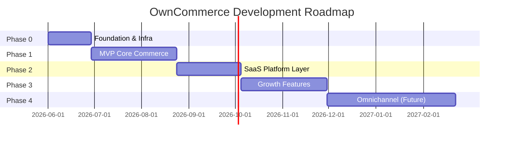

# Rencana Pengembangan OwnCommerce

> Dokumen ini merupakan rencana pengembangan berdasarkan [detail-product.md](./detail-product.md).

---

## Ringkasan Pemahaman

| Aspek | Keputusan |
|---|---|
| **Produk** | SaaS e-commerce untuk merchant punya toko sendiri (bukan marketplace) |
| **Target** | UMKM, brand lokal, seller Shopee/TikTok Shop/Lazada |
| **Arsitektur** | Multi-tenant shared DB + shared schema (`tenant_id` di semua data) |
| **Backend** | Go + Fiber + GORM + PostgreSQL + Redis + Asynq |
| **Frontend** | Monorepo: `web` (storefront), `seller` (merchant), `superadmin` |
| **File Storage** | Local storage (filesystem server) |
| **Hosting** | VPS sendiri (Docker) |
| **CI/CD** | GitHub Actions → automated deploy ke VPS |
| **Domain** | `owncommerce.id` (akan dibeli) |
| **Payment** | Midtrans (storefront MVP + subscription billing) |
| **Skala target** | 10.000+ tenant aktif |

---

## Prinsip Pengembangan

1. **MVP dulu, omnichannel belakangan** — jangan bangun marketplace sync di fase awal.
2. **Tenant isolation dari hari pertama** — semua query wajib `tenant_id`; ini sulit ditambah belakangan.
3. **Modular monolith** — modul jelas, boundary API internal, siap dipecah nanti.
4. **Ship early, iterate** — merchant bisa jualan online dalam 8–12 minggu (MVP).
5. **Feature flag + subscription** — batasi fitur per paket sejak awal, meski paket awal masih sederhana.

---

## Fase Pengembangan (Roadmap)



---

## Phase 0: Foundation (Minggu 1–4)

**Tujuan:** Infrastruktur, monorepo, dan fondasi multi-tenant siap dipakai tim.

> **Strategi saat ini:** Fokus **local development** dulu. VPS, CI/CD deploy, dan Nginx ditunda sampai MVP backend stabil di mesin lokal.

### 0.1 Monorepo & Tooling

```
owncommerce/
├── apps/
│   ├── web/          → Next.js (storefront)
│   ├── seller/       → Next.js (merchant dashboard)
│   ├── superadmin/   → Next.js (internal)
│   └── api/          → Go Fiber
├── packages/
│   ├── ui/           → Design system (shadcn/ui)
│   ├── types/        → Shared TypeScript types
│   ├── sdk/          → API client untuk frontend
│   └── shared/       → Utils, constants
├── storage/          → Local file storage (product images, assets, invoices)
├── infra/
│   ├── docker/
│   ├── nginx/        → Reverse proxy + SSL
│   ├── scripts/      → Deploy script VPS
│   └── migrations/
└── docs/
```

**Deliverables:**

- [x] Setup monorepo (Turborepo + npm workspaces)
- [x] Docker Compose dev: PostgreSQL, Redis (`infra/docker/docker-compose.dev.yml`)
- [x] Local storage directory (`storage/`)
- [x] Environment management (`.env.example`)
- [x] Go API skeleton (Fiber + GORM)
- [ ] Docker Compose prod (ditunda)
- [ ] CI/CD pipeline: lint, test, build, automated deploy ke VPS (ditunda)
- [ ] VPS provisioning: Docker, Nginx, SSL (ditunda)

### 0.2 Database Schema Foundation

Tabel inti multi-tenant:

| Tabel | Keterangan |
|---|---|
| `tenants` | Data merchant/toko |
| `tenant_domains` | Subdomain + custom domain |
| `users` | Semua user (super admin + merchant + customer) |
| `roles`, `permissions`, `role_permissions` | RBAC dinamis |
| `user_roles` | Assignment role per tenant |
| `audit_logs` | Audit trail |
| `subscriptions`, `plans`, `plan_features` | Subscription |
| `feature_flags` | Feature gating |

**Aturan wajib:** middleware `tenant_id` di setiap query commerce.

### 0.3 Core Platform Modules (Backend)

Prioritas implementasi:

```
1. Auth        → JWT (access + refresh), rotation, revocation
2. Tenant      → CRUD tenant, subdomain provisioning
3. IAM         → RBAC dinamis, permission check middleware
4. Audit       → Event logging middleware
```

**Deliverables:**

- [x] Auth API (register merchant, login, refresh, logout)
- [x] Tenant resolver middleware (Host header + `X-Tenant-Slug` untuk local dev)
- [x] RBAC middleware (`product.view`, dll.)
- [x] Audit log writer
- [x] Health check & API versioning (`/v1/`)
- [x] GORM models + AutoMigrate + seed (roles, permissions, plans)
- [x] Local file storage module

---

## Phase 1: MVP Core Commerce (Minggu 5–12)

**Tujuan:** Merchant bisa daftar, tambah produk, customer bisa beli, merchant kelola pesanan.

### 1.1 Merchant Onboarding Flow

```
Daftar → Buat Tenant → Pilih Subdomain → Setup Toko Dasar → Dashboard
```

**Fitur:**

- [ ] Registrasi merchant owner
- [ ] Auto-provision subdomain (`toko.owncommerce.id`)
- [ ] Store settings (nama, logo, deskripsi, kontak)
- [ ] Onboarding wizard

### 1.2 Product & Catalog (Merchant Dashboard)

- [ ] CRUD produk (nama, deskripsi, harga, gambar, SKU)
- [ ] Kategori (hierarki 1 level dulu)
- [ ] Upload gambar → local storage
- [ ] Status produk (draft, active, archived)
- [ ] Inventory dasar (stock quantity, low stock alert)

### 1.3 Storefront (Customer-facing)

- [ ] Homepage (hero, featured products)
- [ ] Product catalog + filter kategori
- [ ] Product detail
- [ ] Search produk (PostgreSQL full-text dulu)
- [ ] Responsive mobile-first

### 1.4 Cart & Checkout

- [ ] Guest cart (session/cookie) + logged-in cart
- [ ] Checkout: alamat, metode pengiriman, ringkasan
- [ ] Order creation (status: `pending_payment`)
- [ ] Integrasi Midtrans Snap (pembayaran langsung di MVP)
- [ ] Webhook handler Midtrans (update status order otomatis)
- [ ] Halaman payment success / failed
- [ ] Order confirmation page

### 1.5 Order Management (Merchant)

- [ ] Daftar pesanan + filter status
- [ ] Detail pesanan
- [ ] Update status (processing → shipped → completed)
- [ ] Cancel order

### 1.6 Customer Account (Storefront)

- [ ] Registrasi & login customer
- [ ] Profil & alamat pengiriman
- [ ] Riwayat pesanan
- [ ] Tracking status pesanan

**MVP Exit Criteria:**

> Merchant bisa daftar, setup toko, tambah produk, customer bisa browse → cart → checkout → bayar via Midtrans → merchant proses pesanan.

---

## Phase 2: SaaS Platform Layer (Minggu 13–18)

**Tujuan:** Platform siap monetisasi — subscription, billing, super admin.

### 2.1 Subscription System

- [ ] Definisi paket: Trial, Starter, Growth, Enterprise
- [ ] Lifecycle: Trial → Active → Renewal → Expired → Suspended
- [ ] Grace period
- [ ] Upgrade/downgrade plan
- [ ] Limit enforcement (jumlah produk, staff, storage)

### 2.2 Feature Flag System

- [ ] `plan_features` mapping
- [ ] Middleware `RequireFeature("custom_domain")`
- [ ] UI: fitur terkunci + upgrade CTA

### 2.3 Billing Engine

- [ ] Invoice generation (background job via Asynq)
- [ ] Reuse modul Midtrans dari MVP (Snap / Core API) untuk subscription billing
- [ ] Payment webhook handler (shared dengan order payment)
- [ ] Billing history
- [ ] Email renewal reminder (7 hari, 1 hari sebelum expired)

### 2.4 Super Admin Dashboard

- [ ] Tenant management (list, detail, suspend/activate)
- [ ] Subscription overview
- [ ] Billing & invoice monitoring
- [ ] User monitoring
- [ ] Impersonation (Login As Merchant) + audit log
- [ ] Platform analytics dasar (total tenant, MRR, active users)

### 2.5 Domain Management

- [ ] Custom domain: DNS verification (CNAME)
- [ ] SSL provisioning (Let's Encrypt / Cloudflare)
- [ ] Domain routing di tenant resolver
- [ ] Feature gate: custom domain hanya Growth+

**Phase 2 Exit Criteria:**

> Merchant bisa berlangganan, bayar via Midtrans, super admin kelola platform, custom domain aktif.

---

## Phase 3: Growth Features (Minggu 19–26)

**Tujuan:** Fitur yang meningkatkan retensi dan diferensiasi.

### 3.1 Promotion Management

- [ ] Kode diskon (percentage / fixed)
- [ ] Minimum order, usage limit, expiry
- [ ] Apply di checkout

### 3.2 Advanced Inventory

- [ ] Multi-variant produk (ukuran, warna)
- [ ] Stock per variant
- [ ] Stock movement log

### 3.3 Analytics (Merchant)

- [ ] Dashboard: revenue, orders, top products
- [ ] Periode filter (hari, minggu, bulan)
- [ ] Export CSV

### 3.4 Multi Staff & RBAC UI

- [ ] Invite staff ke tenant
- [ ] Assign role (Admin, Staff)
- [ ] Permission matrix di UI
- [ ] Limit staff per paket

### 3.5 Shipment Integration

- [ ] Abstraction layer shipping provider
- [ ] Integrasi awal: manual rate / flat rate
- [ ] (Opsional) RajaOngkir / Biteship

### 3.6 Notification System

- [ ] Email: order confirmation, status update, subscription reminder
- [ ] In-app notification (merchant dashboard)
- [ ] Template management

### 3.7 Storefront Enhancement

- [ ] SEO (meta tags, sitemap, structured data)
- [ ] Theme dasar (2–3 preset)
- [ ] Banner / hero management

---

## Phase 4: Omnichannel (Future, Minggu 27+)

**Tujuan:** Visi jangka panjang — hubungkan website + marketplace.

### 4.1 Marketplace Integration

- [ ] Shopee API integration
- [ ] TikTok Shop integration
- [ ] Lazada integration
- [ ] OAuth connect flow per marketplace

### 4.2 Sync Engine

- [ ] Product sync (push/pull)
- [ ] Order sync (import dari marketplace)
- [ ] Inventory sync (two-way)
- [ ] Conflict resolution strategy
- [ ] Sync log & retry (Asynq)

### 4.3 Channel Manager

- [ ] Unified product view across channels
- [ ] Channel-specific pricing
- [ ] Channel status dashboard

### 4.4 Future Modules

- CRM (customer segmentation, tags)
- Marketing automation (email campaign)
- Loyalty program
- AI (product description, pricing suggestion)

---

## Arsitektur Teknis Detail

### Backend Module Structure (Go)

```
apps/api/
├── cmd/
│   ├── server/       → HTTP server
│   └── worker/       → Asynq worker
├── internal/
│   ├── core/
│   │   ├── auth/
│   │   ├── tenant/
│   │   ├── iam/
│   │   ├── subscription/
│   │   ├── billing/
│   │   └── audit/
│   ├── commerce/
│   │   ├── product/
│   │   ├── category/
│   │   ├── inventory/
│   │   ├── customer/
│   │   ├── cart/
│   │   ├── order/
│   │   ├── payment/
│   │   └── shipment/
│   └── platform/
│       ├── middleware/
│       ├── database/ → GORM connection & repository base
│       ├── storage/  → Local file storage handler
│       └── queue/
└── migrations/       → GORM AutoMigrate + SQL migration (golang-migrate)
```

### Request Flow (Multi-Tenant)

```
Customer Request
    → Reverse Proxy (Nginx/Traefik)
    → Tenant Resolver (host → tenant_id)
    → Auth Middleware (JWT validate)
    → RBAC Middleware (permission check)
    → Feature Flag Middleware (plan check)
    → Handler
    → Audit Log (async)
```

### Tech Stack

| Layer | Teknologi | Alasan |
|---|---|---|
| Storefront | Next.js 15 (App Router) | SSR/SSG untuk SEO, React ecosystem |
| Merchant Dashboard | Next.js 15 | Konsistensi, shared packages |
| Super Admin | Next.js 15 | Konsistensi |
| API | Go + Fiber | Performa, concurrency, sesuai rencana |
| ORM | GORM | Produktivitas tinggi, ekosistem matang di Go |
| Database | PostgreSQL 16 | JSONB, full-text search, mature |
| Cache | Redis 7 | Session, rate limit, cache |
| Queue | Asynq | Native Go, Redis-backed |
| File Storage | Local filesystem | Simpel, tanpa dependency cloud storage |
| Payment | Midtrans | Satu provider untuk order & subscription |
| Email | Resend / Brevo | Murah, API simple |
| Hosting | VPS sendiri | Kontrol penuh, biaya predictable |
| CI/CD | GitHub Actions | Lint, test, build, deploy otomatis ke VPS |
| Reverse Proxy | Nginx + Let's Encrypt | SSL, domain routing, static files |

---

## CI/CD & VPS Deployment

### Arsitektur Deploy

```
GitHub (push/merge ke main)
    → GitHub Actions
        → Lint & Test
        → Build Docker images
        → Push ke GitHub Container Registry (ghcr.io)
        → SSH ke VPS
        → Pull images & docker compose up
        → Health check
```

### Komponen di VPS

| Komponen | Keterangan |
|---|---|
| Docker + Docker Compose | Menjalankan API, worker, PostgreSQL, Redis |
| Nginx | Reverse proxy, SSL termination, tenant domain routing |
| Certbot | Auto-renew SSL Let's Encrypt |
| `storage/` volume | Persisten di host, di-mount ke container API |

### Domain Setup (`owncommerce.id`)

Domain akan dibeli dan dikonfigurasi dengan struktur:

| Host | Tujuan |
|---|---|
| `owncommerce.id` | Landing page / marketing |
| `*.owncommerce.id` | Storefront tenant (wildcard subdomain) |
| `seller.owncommerce.id` | Merchant dashboard |
| `admin.owncommerce.id` | Super admin dashboard |
| `api.owncommerce.id` | Backend API |

**DNS yang diperlukan:**

- A record → IP VPS
- Wildcard A record `*.owncommerce.id` → IP VPS
- (Nanti) CNAME custom domain merchant → `owncommerce.id`

### CI/CD Pipeline (GitHub Actions)

**Trigger:** push/merge ke branch `main` (production), `develop` (staging opsional)

**Jobs:**

1. **Lint & Test** — golangci-lint, go test, eslint, typecheck
2. **Build** — Docker image untuk `api`, `worker` (dan frontend jika SSR)
3. **Push** — Image ke `ghcr.io/{org}/owncommerce-{service}`
4. **Deploy** — SSH ke VPS, jalankan deploy script:
   - `docker compose pull`
   - `docker compose up -d --remove-orphans`
   - Run migration (GORM / golang-migrate)
   - Health check endpoint

**Secrets GitHub (perlu disiapkan):**

- `VPS_HOST`, `VPS_USER`, `VPS_SSH_KEY`
- `DATABASE_URL`, `REDIS_URL`, `JWT_SECRET`
- `MIDTRANS_SERVER_KEY`, `MIDTRANS_CLIENT_KEY`
- Env lainnya per environment

### Deploy Script (`infra/scripts/deploy.sh`)

- Pull latest images
- Backup database sebelum migration (opsional)
- Run migration
- Rolling restart container
- Health check, rollback jika gagal

---

## Storage Architecture

### Database

- PostgreSQL

### Cache

- Redis

### File Storage (Local)

File disimpan di filesystem server, bukan cloud storage (S3).

**Struktur direktori:**

```
storage/
├── tenants/
│   └── {tenant_id}/
│       ├── products/       → Gambar produk
│       ├── store/          → Logo, favicon, banner toko
│       ├── themes/         → Asset tema
│       └── documents/      → Invoice, dokumen lain
└── platform/               → Asset platform (opsional)
```

**Konfigurasi:**

- Path root disimpan di environment variable (`STORAGE_PATH`)
- Volume mount di Docker agar file persisten antar restart
- Backup berkala direktori `storage/` (rsync, tar, atau backup VPS)

**Serving file:**

- API menyediakan endpoint static file: `GET /files/{tenant_id}/{path}`
- Atau reverse proxy (Nginx) serve langsung dari direktori `storage/`
- Validasi akses: file tenant hanya bisa diakses via domain tenant yang sesuai

**Pertimbangan:**

- Enforce batas storage per paket subscription (hitung total ukuran file per tenant)
- Validasi tipe file (MIME) dan ukuran maksimum saat upload
- Generate unique filename untuk hindari collision
- Untuk skala besar di masa depan, migrasi ke object storage tetap bisa dilakukan via abstraction layer

---

## Prioritas Database Schema

```sql
-- Core (Phase 0)
tenants, tenant_domains, users, roles, permissions,
role_permissions, user_roles, audit_logs

-- Subscription (Phase 2, schema siap Phase 0)
plans, plan_features, subscriptions, invoices, payments

-- Commerce (Phase 1)
categories, products, product_images, product_variants,
inventories, customers, customer_addresses,
carts, cart_items, orders, order_items, order_status_history,
payments (Midtrans transaction log)

-- Growth (Phase 3)
promotions, promotion_usages, notifications, shipments
```

---

## Estimasi Tim & Timeline

### Tim Minimum (MVP dalam ~3 bulan)

| Role | Jumlah | Fokus |
|---|---|---|
| Backend Engineer (Go) | 1–2 | API, multi-tenant, commerce |
| Frontend Engineer | 1–2 | Storefront + merchant dashboard |
| Full-stack / Lead | 1 | Arsitektur, super admin, infra |
| Designer (part-time) | 0.5 | UI/UX storefront & dashboard |

### Timeline Ringkas

| Fase | Durasi | Output |
|---|---|---|
| Phase 0: Foundation | 4 minggu | Infra, CI/CD, auth, tenant, RBAC |
| Phase 1: MVP Commerce | 8 minggu | Toko online end-to-end + Midtrans |
| Phase 2: SaaS Layer | 6 minggu | Subscription, billing, super admin |
| Phase 3: Growth | 8 minggu | Promo, analytics, multi-staff |
| Phase 4: Omnichannel | 12+ minggu | Marketplace sync |

**Total ke production-ready SaaS: ~6 bulan**  
**Total ke omnichannel: ~9–12 bulan**

---

## Risiko & Mitigasi

| Risiko | Dampak | Mitigasi |
|---|---|---|
| Tenant data leak | Kritis | Middleware `tenant_id` wajib, integration test isolasi |
| Payment webhook gagal | Tinggi | Idempotent handler, retry queue, manual reconciliation |
| Custom domain SSL | Sedang | Cloudflare for SaaS atau Caddy auto-SSL |
| Scope creep omnichannel | Tinggi | Tunda ke Phase 4, fokus MVP dulu |
| Marketplace API berubah | Sedang | Abstraction layer, adapter pattern |
| Skala 10K tenant | Sedang | Index `tenant_id`, connection pooling, read replica nanti |
| Disk penuh (local storage) | Sedang | Monitoring disk usage, quota per tenant, backup rutin |
| Deploy gagal di VPS | Sedang | Health check + rollback script, backup DB sebelum migration |
| Midtrans webhook tidak sampai | Tinggi | Idempotent handler, retry log, endpoint dapat diakses publik via HTTPS |

---

## Langkah Pertama (Action Items)

Urutan implementasi yang disarankan:

1. **Setup monorepo** — struktur folder sesuai dokumen
2. **Docker Compose** — PostgreSQL, Redis
3. **Local storage** — direktori `storage/`, volume mount, env `STORAGE_PATH`
4. **Go API skeleton** — Fiber + GORM, health check
5. **Migration Phase 0** — GORM models + migration `tenants`, `users`, `roles`, `permissions`
6. **Auth module** — register, login, JWT
7. **Tenant resolver** — subdomain routing (`*.owncommerce.id`)
8. **File upload module** — upload ke local storage, serve static files
9. **CI/CD pipeline** — GitHub Actions workflow + deploy script VPS
10. **Merchant dashboard skeleton** — login page, dashboard layout
11. **Storefront skeleton** — homepage placeholder dengan tenant resolution
12. **Midtrans integration** — Snap payment + webhook (bagian MVP)

---

## Keputusan Teknis (Terkunci)

| Keputusan | Pilihan | Catatan |
|---|---|---|
| ORM Go | **GORM** | AutoMigrate untuk dev, golang-migrate untuk production |
| Hosting | **VPS sendiri** | Docker Compose di VPS, Nginx sebagai reverse proxy |
| CI/CD | **GitHub Actions** | Automated deploy ke VPS on push ke `main` |
| Domain | **`owncommerce.id`** | Akan dibeli; wildcard `*.owncommerce.id` untuk tenant |
| Payment | **Midtrans** | Satu-satunya payment provider |
| MVP Payment | **Midtrans langsung** | Tidak pakai manual transfer; Snap di checkout storefront |

## Keputusan yang Masih Terbuka

1. **Monorepo tool:** Turborepo vs Nx?
2. **Email provider:** Resend vs Brevo?
